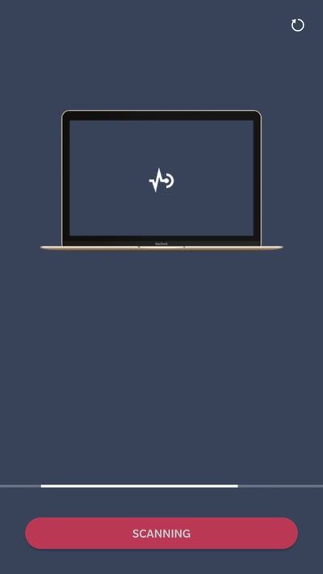

## 使用 Android 手机控制 MAC PPT 播放

不算稀奇的话题了，也有现成的软件可以实现，不过自己想造个轮子试试，就开始了。
远程控制软件需要解决两个问题：
- 如何通信
- 如何控制电脑

关于第一个问题，使用的是HTTP方式，略重，不过可以简单的兼容任何系统，当然会收到网络的波动影响响应速度  
关于第二个问题，使用 golang 写了一个服务，调用 MAC 的 AppleScript 完成向屏幕发送键盘事件实现

### 结果
从原型图，到设计稿，到代码时间，总计用了一天左右。  
测试结果：  
在正常的局域网下，响应速度没的说，在公司测试下来，延迟在150ms左右，如果是播放PPT这种的操作，延迟可以接受  
Android的扫描实现目前比较暴力，是向同网段的所有人发送TCP包，看那个有响应，目前的扫描速度是在10s左右，这个是一个瓶颈  
截图：  

