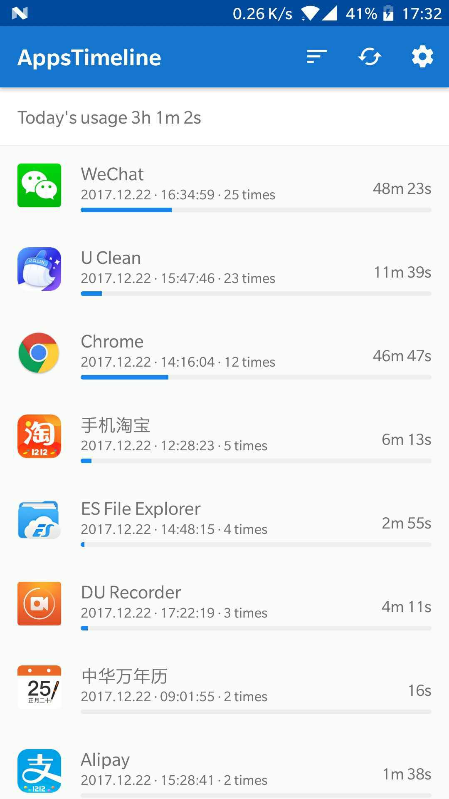

## 监控手机Apps的使用时间占比

主要实现功能是监控手机的App使用情况，包括每天的使用时长、使用次数、使用顺序以及每个App每天的详细使用情况
初衷是为了做时间管理，明确的知道自己每天都把时间花在哪里了

## 有图有真相

点击可以查看视频  

## 支持版本
>= 5.1版本

## 下载
- [GooglePlay下载地址](https://play.google.com/store/apps/details?id=timeline.lizimumu.com.t)
- [Github Release](https://github.com/zhaobao/AppsTimeline/releases)